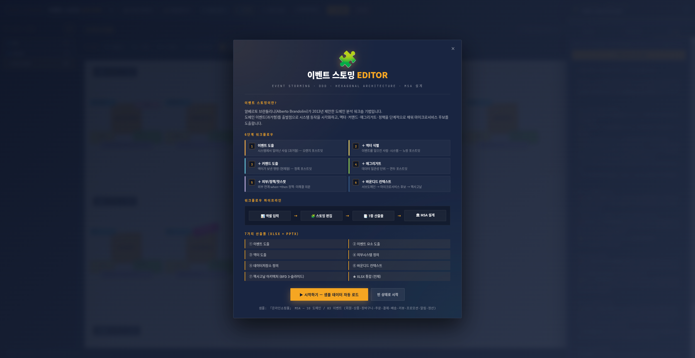

<h1 align="center">MSA Design Studio</h1>

<p align="center">
  <strong>Event Storming + DDD + Hexagonal Architecture + AI Assistant — Microservice Design Studio</strong>
</p>

<p align="center">
  <a href="https://msa-dev.fact-mine.com">
    
  </a>
  <a href="https://msa-dev.fact-mine.com/demo/ecommerce-storming.html">
    
  </a>
</p>

<p align="center">
  
</p>

<p align="center">
  🇰🇷 <a href="README.md">한국어 README</a> &nbsp;·&nbsp; 🇬🇧 English
</p>

---

## What is this?

**MSA Design Studio** is a digital canvas for **Event Storming** (Alberto Brandolini, 2013).
Starting from past-tense domain events, you progressively fill in actors, commands, aggregates, and policies — naturally identifying **bounded contexts** and producing a **Hexagonal Architecture diagram** plus full microservice specifications.

In one sentence: **Excel sheet → Storming board → 7 deliverables (XLSX·PPTX) → MSA blueprint**

🔗 **Live demo**: [https://msa-dev.fact-mine.com](https://msa-dev.fact-mine.com)

---

## 📺 45-Second Walkthrough

Watch the **6 phases of Event Storming** unfold automatically over ~45 seconds — domain events → actors → commands → aggregates → externals/policies → bounded contexts → microservice cards.

| How to view | Link |
|---|---|
| 🌐 **Live site** | [msa-dev.fact-mine.com/demo/ecommerce-storming.html](https://msa-dev.fact-mine.com/demo/ecommerce-storming.html) |
| 🪄 **From the editor** | Top-right **📺** button or intro splash → "📺 Watch walkthrough (45s)" |

**Domain shown**: E-Commerce — 9 events · 5 microservice candidates · external systems · auto-extracted policies & hotspots.

---

## 📸 Screenshots

### 1) Intro Splash — First-visit Guide

Onboarding screen showing the 6-step workflow and 7 deliverables.



### 2) Main Storming Board + AI Review

Left BC tree + center event cards (event · command · actor · policy · hotspot · external) + right ⚡ AI review panel — auto report on naming consistency, missing fields, Saga flows, BC coupling.


### 3) Hexagonal Architecture View (Auto per BC)

3 nested hexagons mapped to DDD layers (Domain · Application · Infrastructure) + Driving/Driven color bands + 4 I/F boxes + Command/Event slots + 16 directional arrows + OR Mapper + DB. **PPT output: 1 BC = 3 slides** (BFD-A · BFD-B · Hexagonal).


### 4) AI Chat + RAG (Source Citations)

Local Gemma 27B + BGE-M3 + ChromaDB indexing 8 MSA reference docs. Answers include automatic `[출처: 04-saga.md]` chunk citations.


---

## Why this exists

When breaking a monolith into microservices, the biggest blockers are:

1. **No common language** between domain experts and developers (DDD ubiquitous language)
2. **Unsystematic identification** of events, commands, and aggregates
3. BC discovery relies on intuition → micro-monoliths, God BCs, circular dependencies
4. **80% of architect time wasted** on PowerPoint/Excel diagrams

This tool handles all of these stages in a single screen, then auto-generates **30 PPTX slides + 8 XLSX sheets**.

---

## Core Features

### 1. 6-Step Event Storming Workflow

| Step | Output | Color | Key Question |
|------|--------|-------|--------------|
| ① **Domain Event** | Orange (past tense) | `#F5A623` | "What happened in the system?" |
| ② **+ Actor** | Yellow | `#FFE066` | "Who/what triggered this event?" |
| ③ **+ Command** | Mint | `#6BCFE5` | "What command produced this event?" |
| ④ **+ Aggregate** | Green | `#A0E050` | "Which domain object enforces consistency?" |
| ⑤ **+ External / Policy / Hotspot** | Pink/Purple/Magenta | — | "External deps, when→then policies, open questions" |
| ⑥ **+ Bounded Context** | Dashed box | — | "Subdomains → microservice candidates" |

### 2. 7 Auto-Generated Deliverables (XLSX + PPTX)

| # | Deliverable | XLSX | PPTX |
|---|-------------|:----:|:----:|
| ① | Domain Events | ✅ | ✅ |
| ② | Event Storming Elements | ✅ | ✅ |
| ③ | Actors | ✅ | ✅ |
| ④ | External Systems | ✅ | ✅ |
| ⑤ | Data Stores | ✅ | ✅ |
| ⑥ | Bounded Contexts | ✅ | ✅ |
| ⑦ | **Hexagonal Architecture** | ✅ | ✅ (BC × 3 slides) |
| ★ | Unified XLSX | ✅ | — |

### 3. Hexagonal Diagram (16:9 PPT)

3 nested hexagons mapped to DDD layers (Infrastructure / Application / Domain) + Driving/Driven side bands + 4 I/F boxes (Service Inbound · Proxy/Event/Repository Outbound) + 16 directional arrows + Command/Event 6 slots + ApplicationService use case strip.

### 4. AI Assistant (Local LLM + RAG)

Floating ⚡ panel with 3 modes:

- **💬 Chat** — Free-form questions with auto source citations from 8 MSA reference docs
- **⚡ Event Extraction** — Natural language → JSON (events/actors/externals/stores) → one-click apply to board
- **🔍 Review** — State analysis → markdown report on naming consistency, missing fields, Saga gaps, hotspots

> **Backend**: Gemma 27B + BGE-M3 embeddings + ChromaDB — fully local, **zero external API calls**.

---

## Architecture

```
┌──────────────┐    ┌──────────────┐    ┌──────────────────┐
│  Browser     │───▶│  Express     │───▶│ Python AI Server │
│ (Editor UI)  │/api│  (proxy)     │HTTP│  (FastAPI)       │
└──────────────┘    └──────────────┘    └────────┬─────────┘
                                                  │
                                ┌─────────────────┼─────────────────┐
                                ▼                 ▼                 ▼
                          ┌────────────┐  ┌─────────────┐  ┌──────────────┐
                          │  Ollama    │  │  ChromaDB   │  │   BGE-M3     │
                          │ Gemma 27B  │  │ (RAG index) │  │  Embedder    │
                          └────────────┘  └─────────────┘  └──────────────┘
```

- **Client**: Single HTML/CSS/JS file, Pretendard font, dark navy + orange theme
- **Express (Node.js)**: Static hosting + `/api/*` proxy + helmet
- **Python (FastAPI)**: PPTX/XLSX generation, RAG retrieval, LLM calls
- **Ollama**: Gemma 27B Q4_K_M (~16GB VRAM)
- **ChromaDB + BGE-M3**: Multilingual (Korean/English) embeddings

---

## Documentation

- 📖 [Features](docs/features.md)
- 🔄 [Workflow](docs/workflow.md)
- 📊 [Outputs](docs/outputs.md)
- 🤖 [AI Assist](docs/ai-assist.md)

---

## Source Code

This repository contains **documentation and samples only**. The actual source code is in a private repository. The live demo is free for personal/educational use.

For commercial / on-premise / enterprise inquiries, please open an issue.

---

## License

Documentation & samples — [CC BY 4.0](LICENSE).
Live demo — free, no signup required.
Source code — proprietary.

---

## Credits

- **Event Storming** — Alberto Brandolini (2013)
- **Hexagonal Architecture** — Alistair Cockburn (2005)
- **DDD** — Eric Evans (2003)
- **Saga Pattern** — Hector Garcia-Molina, Kenneth Salem (1987)
- **Pretendard font** — orioncactus

---

<p align="center">
  <strong>🌐 Try it now at <a href="https://msa-dev.fact-mine.com">msa-dev.fact-mine.com</a></strong>
</p>
