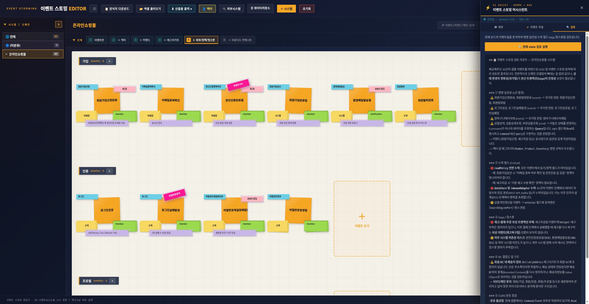
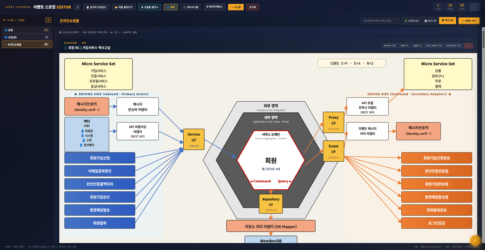
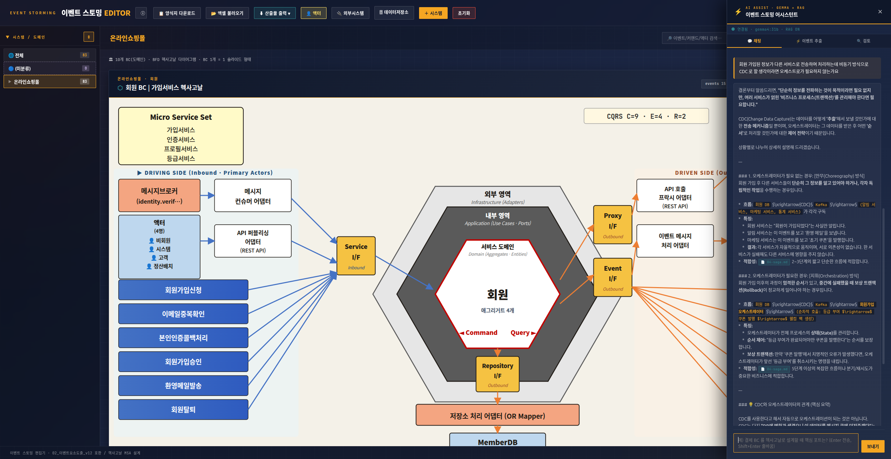

# Samples — 샘플 데이터

이 도구의 표준 입출력 형식을 보여주는 실제 샘플들.

## 01 · 온라인쇼핑몰 (E-commerce)

가장 흔한 MSA 사례 — 10 도메인 / 83 이벤트 풀 워크숍 결과.

### 화면 미리보기

| 보드 + AI 검토 | 헥사고날 다이어그램 | AI 채팅 |
|---|---|---|
|  |  |  |

### 입력 데이터
📂 [`01-ecommerce-events.xlsx`](01-ecommerce-events.xlsx) — 표준 17 컬럼 형식 (15 KB · 5 시트)

| 시트 | 내용 |
|---|---|
| 전체이벤트 | 83 행 × 17 컬럼 (이벤트 카드 풀 매트릭스) |
| 액터 | 14 행 (고객·관리자·시스템·정산배치 등) |
| 외부시스템 | 12 행 (PG시스템·CJ대한통운·AWS SES·FCM 등) |
| 데이터저장소 | 15 행 (PostgreSQL·Redis·ES·MongoDB·S3) |
| 작성가이드 | 입력 형식 안내 |

### 결과물 (HTML 미리보기)
📂 [`01-ecommerce-event-storming.html`](01-ecommerce-event-storming.html) — 이벤트 스토밍 보드를 webpage 로 export 한 완성 결과 (46 KB)

브라우저로 직접 열면 전체 워크숍 결과를 한눈에 볼 수 있습니다. 인쇄 가능 (A3 권장).

### 도메인 구성

| BC | 서브도메인 | 이벤트 | 핵심 흐름 |
|----|-----------|-------:|-----------|
| **회원** | 가입·인증·프로필·등급 | 15 | KCB 본인인증 + JWT(15m/14d) + 5회 실패 잠금 + 월별 등급 산정 |
| **상품** | 카테고리·상품·재고·검색 | 12 | Outbox→Kafka→ES 색인 + 분산락 재고 + 협업필터링 추천 |
| **장바구니** | 장바구니·위시리스트 | 5 | Redis 카트 (7일 TTL) — 비회원 쿠키, 회원 영구 |
| **주문** | 주문·취소·조회 | 12 | Saga 시작 → 결제→재고→배송 → 보상 트랜잭션 |
| **결제** | 처리·환불·결제수단 | 10 | PG Idempotency-Key, 카드 빌링키 위탁(PCI-DSS), Webhook 서명검증 |
| **배송** | 요청·추적·반품교환 | 8 | 택배사 Webhook + D+7 자동 구매확정 |
| **리뷰** | 후기·평점 | 5 | 구매확정자 한정 + Kafka로 평점 평균 갱신 |
| **프로모션** | 쿠폰·적립금 | 6 | 선착순 락(SETNX) + 1% 적립 + Saga 차감 |
| **알림** | 트랜잭션·마케팅 | 5 | order.confirmed → SMS·SES·FCM 동시 |
| **정산** | 매출분석·정산 | 5 | 일별 03:00 배치 + 외부 ERP 연동 |

### 외부 시스템 12종
PG시스템(Toss/이니시스/PortOne) · 카카오페이 · 네이버페이 · CJ대한통운 · 한진택배 · NHN Toast SMS · AWS SES · FCM · KCB 본인인증 · 외부 ERP · 추천엔진 · 검색엔진(Elasticsearch)

### 패턴 적용
- **Saga**: 주문→결제→재고차감→배송요청 (Orchestration)
- **CQRS**: Command 33 / Event 31 / Read 19 (분리 비율 적정)
- **Outbox**: order/payment/inventory 모든 핵심 이벤트
- **Webhook**: PG 콜백·택배 추적·KCB 인증 (서명검증 + 멱등 처리)
- **폴리글랏 퍼시스턴스**: PostgreSQL(코어) · Elasticsearch(검색) · MongoDB(리뷰/알림이력) · Redis(카트/세션/락) · S3(미디어)

### 핫스팟 (워크숍 발견 사항)
결제대기 · 재고부족 · 신고누적 · 카드정보유출 · 선착순폭주 · 비밀번호공격 · 위변조시도 · 스팸한도

---

## 사용법

### 1) 라이브 데모에서 직접 보기
[https://msa-dev.fact-mine.com](https://msa-dev.fact-mine.com) 접속 → 첫 방문 시 **시작하기** 클릭 → 이 샘플이 자동 로드됨.

### 2) 본인 데이터로 시작하기
1. UI 상단 **📋 양식지 다운로드** 클릭 → 빈 양식 5 시트 받기
2. `전체이벤트` 시트에 본인 도메인 이벤트 입력
3. **📂 엑셀 불러오기** 로 업로드
4. STEP 6단계 따라 보강
5. **⬇ 산출물 출력** → PPTX/XLSX 다운로드

---

## 추가 샘플 요청

다른 도메인 (헬스케어·은행코어·물류·구독서비스 등) 샘플이 필요하면 Issue 로 요청.
